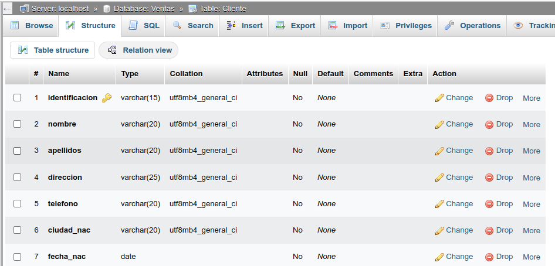
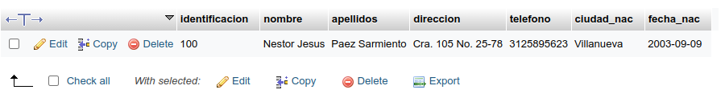

# INTRODUCCIÓN A SQL

1. Creación de una base de datos (BD) con MySQL usando phpMyAdmin

## Creación tabla Cliente
### Diccionario de datos
|Campo|Tipo de dato|Longitud|
|-----|------------|--------|
|***identificacion**|varchar|15|
|nombre|varchar|20|
|apellidos|varchar|20|
|direccion|varchar|25|
|telefono|varchar|20|
|ciudad_nac|varchar|20|
|fecha_nac|date||

### Código SQL de creación de la tabla Cliente

CREATE TABLE `Ventas`.`Cliente` (`identificacion` VARCHAR(15) NOT NULL , `nombre` VARCHAR(20) NOT NULL , `apellidos` VARCHAR(20) NOT NULL , `direccion` VARCHAR(25) NOT NULL , `telefono` VARCHAR(20) NOT NULL , `ciudad_nac` VARCHAR(20) NOT NULL , `fecha_nac` DATE NOT NULL , PRIMARY KEY (`identificacion`)) ENGINE = InnoDB;

### Diccionario de datos en phpMyAdmin

### Registro de datos en tabla Cliente

#### Codigo SQL de inserción de un registro a la tabla Cliente
`` INSERT INTO `Cliente` (`identificacion`, `nombre`, `apellidos`, `direccion`, `telefono`, `ciudad_nac`, `fecha_nac`) VALUES ('100', 'Nestor Jesus', 'Paez Sarmiento', 'Cra. 105 No. 25-78', '3125895623', 'Villanueva', '2003-09-09'); ``

#### Primer registro en phpMyAdmin
